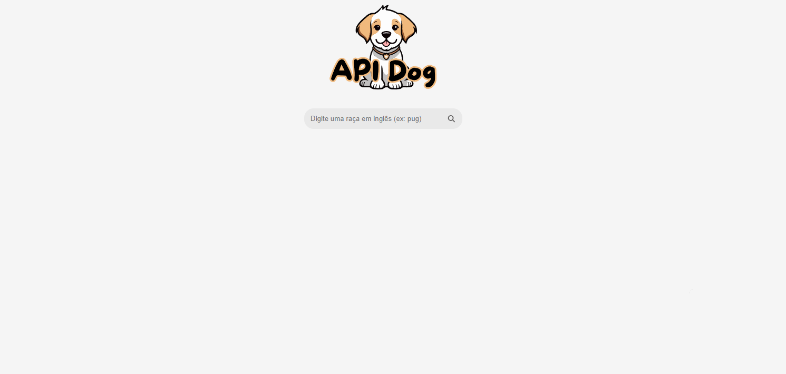
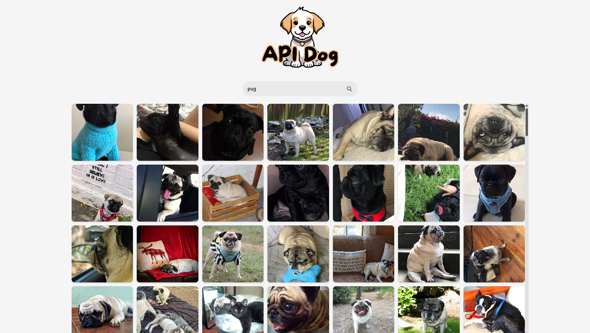

# Site API Dog - Vue.js


## Site
É um site desenvolvido com Vue.js que consome a Dog API para exibir fotos de cachorros de acordo com a raça digitada pelo usuário.





## Vue.js
Ele é um framework JavaScript progressivo e de código aberto, focado na criação de aplicações web. Criado em 2014 por Evan You, o framework é popular por sua curva de aprendizado rápida e tranquila, sendo uma ótima opção para iniciantes. Ele pode ser utilizado tanto em sistemas legados quanto em projetos modernos.


### Por que utilizá-lo
Os principais motivos para utilizar o Vue são:
* Facilidade de aprendizado;
* Componentes reativos;
* Alto desempenho;
* Flexibilidade e integração;
* Ecossistema poderoso;
* Documentação bem explicativa.


### Em quais cenários ele não é indicado
Ele não é indicado nos seguintes tópicos:
* Aplicações extremamente simples;
* Projetos que dependam estritamente de bibliotecas de terceiros incompatíveis;
* Quando a equipe não está habituada com o framework.


## Requisitos do ambiente Vue

- Biblioteca Node
- VS Code
- Extensão do Vue.js

## Comandos de Criação

### Comando de instalação do Vue

```bash
npm install -g @vue/cli
```
Ou

```bash
yarn global add @vue/cli
```
depois

```bash
vue create [Nome do projeto]
```

### Instalação via CDN

Obs: Essa instalação, fica limitada a utilização de Web Components

```bash 
<script src="https://unpkg.com/vue@3/dist/vue.global.js"></script>
```
### Execução do Vue.js

Para execurtamos localmente o vue, basta utilizarmos o comando:

```bash
npm run serve
```

Ou

```bash
npm run dev
```

Esses comandos criam um servidor local que atualiza automaticamente conforme o código é escrito.


#### Principais componentes do Vue.js
Na sua sintaxe, existem os três blocos principais:

```sh
<script>
<template>
<style>
```


## Tecnologias utilizadas para criar o site
* [Vue.js](https://pt.vuejs.org/)
* [Dog API](https://dog.ceo/dog-api/)

## Autores
* [Gustavo Pereira](https://github.com/gpereiraaa)
* [Samara](https://github.com/Samys003) 